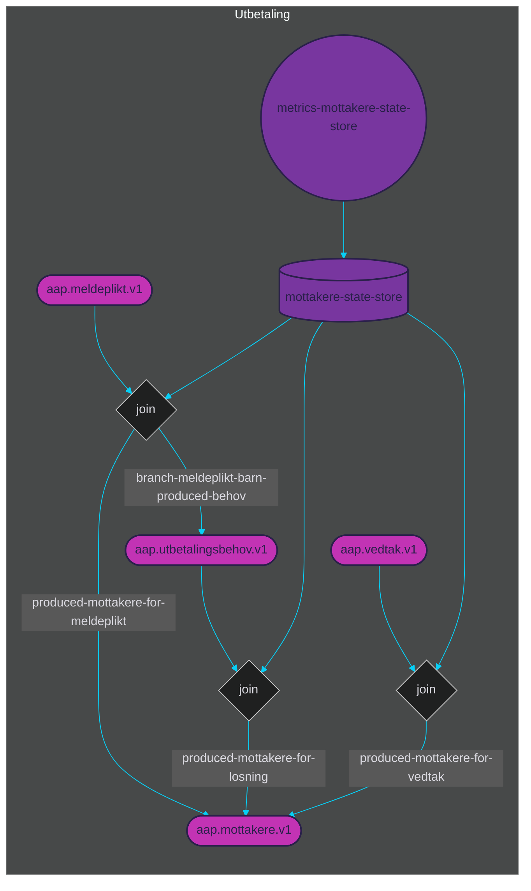

```mermaid

%%{init: {'theme': 'dark', 'themeVariables': { 'primaryColor': '#07cff6', 'textColor': '#dad9e0', 'lineColor': '#07cff6'}}}%%

graph LR

subgraph Utbetaling
    %% TOPICS
    aap.meldeplikt.v1([aap.meldeplikt.v1])
	aap.utbetalingsbehov.v1([aap.utbetalingsbehov.v1])
	aap.vedtak.v1([aap.vedtak.v1])
	aap.mottakere.v1([aap.mottakere.v1])
    
    %% JOINS
    join-0{join}
	join-1{join}
	join-2{join}
    
    %% STATE STORES
    mottakere-state-store[(mottakere-state-store)]
    
    %% PROCESSOR API JOBS
    metrics-mottakere-state-store((metrics-mottakere-state-store))
    
    %% JOIN STREAMS
    aap.meldeplikt.v1 --> join-0
	mottakere-state-store --> join-0
	join-0 --> |branch-meldeplikt-barn-produced-behov| aap.utbetalingsbehov.v1
	join-0 --> |produced-mottakere-for-meldeplikt| aap.mottakere.v1
	aap.utbetalingsbehov.v1 --> join-1
	mottakere-state-store --> join-1
	join-1 --> |produced-mottakere-for-losning| aap.mottakere.v1
	aap.vedtak.v1 --> join-2
	mottakere-state-store --> join-2
	join-2 --> |produced-mottakere-for-vedtak| aap.mottakere.v1
    
    %% JOB STREAMS
    metrics-mottakere-state-store --> mottakere-state-store
    
    %% REPARTITION STREAMS
    
end

%% COLORS
%% light    #dad9e0
%% purple   #78369f
%% pink     #c233b4
%% dark     #2a204a
%% blue     #07cff6

%% STYLES
style aap.meldeplikt.v1 fill:#c233b4, stroke:#2a204a, stroke-width:2px, color:#2a204a
style aap.utbetalingsbehov.v1 fill:#c233b4, stroke:#2a204a, stroke-width:2px, color:#2a204a
style aap.vedtak.v1 fill:#c233b4, stroke:#2a204a, stroke-width:2px, color:#2a204a
style aap.mottakere.v1 fill:#c233b4, stroke:#2a204a, stroke-width:2px, color:#2a204a
style mottakere-state-store fill:#78369f, stroke:#2a204a, stroke-width:2px, color:#2a204a
style metrics-mottakere-state-store fill:#78369f, stroke:#2a204a, stroke-width:2px, color:#2a204a

```
